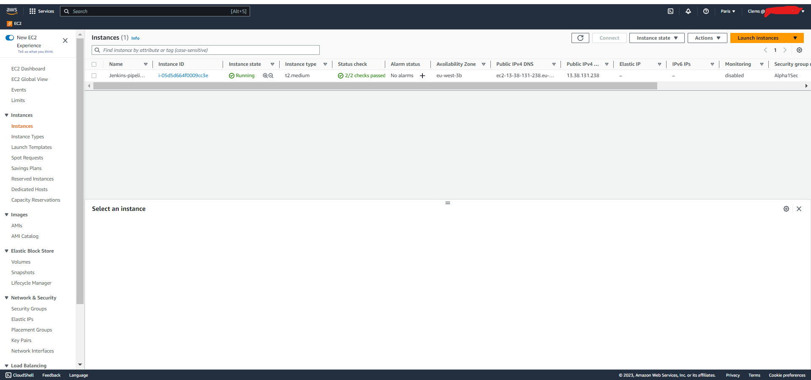

# Continuous Testing continuous integration and continuous delivery/deployment using Jenkins

In this task we will use [github actions](https://github.com/actions) for CI then Jenkins for CI/CD.

## Installations
launch an ec2 instance on [AWS console](https://aws.amazon.com/console/) and open ports 8080, 22 and 80 in your security group


ssh into the machine.

On the ec2 instance [install Jenkins Engine]()

```
#! /bin/bash

sudo apt update -y
sudo apt-get install fontconfig openjdk-11-jre 
wget -q -O - https://pkg.jenkins.io/debian-stable/jenkins.io.key | sudo apt-key add -
sudo sh -c 'echo deb http://pkg.jenkins.io/debian-stable binary/ > /etc/apt/sources.list.d/jenkins.list'
sudo apt update -y
sudo apt install jenkins -y
sudo systemctl start jenkins

```
Open the GUI of the Jenkins engine with the username set at installation step and the password copied from 
```
/var/lib/jenkins/secrets/initialAdminPassword
```

## Jenkins configuration
From the Jenkins GUI install plugins necessary such as Nodejs, docker plugin, git and others

Install redis-server from your ssh connection, start the server and check its status
```
curl -fsSL https://packages.redis.io/gpg | sudo gpg --dearmor -o /usr/share/keyrings/redis-archive-keyring.gpg

echo "deb [signed-by=/usr/share/keyrings/redis-archive-keyring.gpg] https://packages.redis.io/deb $(lsb_release -cs) main" | sudo tee /etc/apt/sources.list.d/redis.list

sudo apt-get update
sudo apt-get install redis
```
## Install [docker engine](https://docs.docker.com/engine/install/ubuntu/)

Crreate credentials for github and dockerhub and an NGINX server to manage source codes, build images and deploy image to servers respectively( these credentials are needed because the repositories are private)

## Create a pipeline project 

On Jenkins once all installations have been made, 
* create the pipeline project,
* create your Jenkinsfile
* create Dockerfile 
 which are pushed into the SCM(github)

Remember that you need to integrate your version control system with Jenkins


Run your pipeline by triggering a commit into the repository and make necessary debugging
